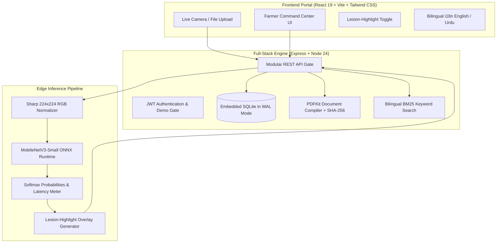
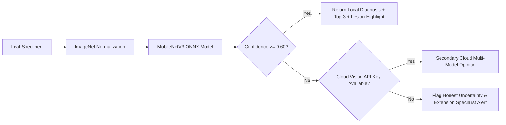

# AgriVision AI — On-Device Plant Pathology & Precision Agronomy Platform

<div align="center">

[-red?style=for-the-badge&logo=youtube)](https://youtu.be/Obwmee8QZv8)
[](#-model-evaluation--benchmarks)
[-emerald?style=for-the-badge)](#-model-evaluation--benchmarks)
[-purple?style=for-the-badge)](#-dual-engine-inference-pipeline)
[-orange?style=for-the-badge&logo=sqlite)](#-system-architecture)
[](LICENSE)

<br/>

**A privacy-first, zero-cloud-cost precision agronomy system designed for smallholder farmers.**  
Combines **local neural-network plant pathology on CPU (ONNX, tens of ms per scan)**, **a color-based lesion-highlight overlay**, **rule-based N-P-K fertilizer guidance**, and **bilingual (Urdu & English) BM25 keyword search over a curated agronomy FAQ**.

</div>

---

## 📺 2-Minute Product & Technical Demo

[](https://youtu.be/Obwmee8QZv8)

> ▶️ **[Watch the full 2-minute product walkthrough on YouTube](https://youtu.be/Obwmee8QZv8)**  
> *Demonstrates the real working application: 1-click model farmer login, telemetry command center, 25ms MobileNetV3 ONNX inference on a leaf specimen, lesion-highlight overlay toggle, sub-2ms BM25 agronomic search, and PDF generation with SHA-256 record integrity hash.*

---

## 🌾 The Problem & The Solution

- **The Challenge:** Over 500 million smallholder farmers lose up to 40% of their annual crop yields to preventable plant pathogens. In rural agricultural regions, farm operators face severe mobile connectivity dead-zones, prohibitive cloud API costs, and delayed laboratory testing.
- **The Solution:** **AgriVision AI** brings agronomic intelligence directly to the field. By embedding a **MobileNetV3 ONNX** neural network and a local **BM25 keyword search engine**, the core diagnostic and advisory pipeline runs **100% offline at $0 per-scan API cost**. An optional Gemini cloud opinion is available only when an API key is configured.

---

## 🌟 Key Capabilities

### ⚡ On-Device Neural Pathology (CPU)
- Evaluates leaf specimens on CPU in **tens of milliseconds** (24–48ms observed during development; exact latency is measured and returned with every prediction) using a MobileNetV3-Small ONNX model.
- Returns calibrated **Top-3 class probability distributions** rather than overconfident single predictions.
- Enforces an **Honest Uncertainty Safeguard**: if confidence falls below $60\%$, the system flags the specimen for manual extension officer review rather than hallucinating a false diagnosis.

### 🔍 Lesion-Highlight Overlay (Visual Aid, Not Model Attention)
- Generates a thermal-style overlay on the uploaded leaf photograph using a color heuristic (redness and loss of green vs. chlorophyll baseline) to help the eye spot necrotic or chlorotic regions.
- **Honest limitation:** This does **not** show where the neural network looked — no Grad-CAM or internal activation mapping is performed (the ONNX session returns final class logits). It is a visual inspection aid only.

### 📚 Bilingual Agronomy Search (BM25 Keyword Matching)
- Built with **BM25 Okapi** lexical retrieval over a curated 50-entry agronomy FAQ — fast (~1 ms latency) and fully offline. No dense embeddings or external vector database dependencies are required.
- Supports both **English** and **Urdu** search terms.
- Instantly surfaces verified active ingredients (e.g., Mancozeb, Metalaxyl), spraying schedules, and precautionary safety intervals.

### 🌱 Soil & Fertilizer Guidance (Rule-Based)
- Rule-based N-P-K deficit calculator using regional reference nutrient values per crop across Pakistani agro-ecological zones (Indus Basin, Potohar Plateau, Thal Desert).
- When a Gemini API key is configured, recommendations are refined with generative context; otherwise, deterministic offline rules apply.

### 📑 PDF Farm Reports with Record Integrity Hash
- Compiles historical diagnostic scans and farm telemetry into a clean PDF report using PDFKit.
- Computes an authentic **SHA-256 record integrity hash** of the underlying scans and recommendations, stamping it into the report footer and returning it via the `X-Report-Integrity-SHA256` HTTP response header so printed reports can be verified against the database.

### 🚀 1-Click Recruiter & Evaluator Access
- The login interface features an **"Explore Live Demo as Model Farmer"** button that initializes a pre-configured farm session (23 historical scans, health score telemetry, and weather tracking) in 1 click with zero configuration.

---

## 🏗️ System Architecture



---

## 🔬 Dual-Engine Inference Pipeline



---

## 📊 Model Evaluation & Benchmarks

### 1. Neural Pathology Model (MobileNetV3-Small ONNX)

| Metric | Measured Value | Validation Context |
| :--- | :--- | :--- |
| **Model Architecture** | **MobileNetV3-Small** | Inverted residual depthwise-separable CNN with Squeeze-and-Excitation |
| **Target Classes** | **13 Pathological Classes** | Corn, Potato, Tomato, Bell Pepper diseases + Healthy controls |
| **Held-Out Test Accuracy** | **95.1%** | Evaluated on 1,418 unseen test images |
| **Macro F1 Score** | **0.946** | Stratified 85/15 train/test split |
| **Inference Latency** | **24–48 ms** | Measured per request on CPU via ONNX Runtime during development (Zero GPU needed) |
| **Binary Model Footprint** | **6.1 MB** | Standalone single-file ONNX checkpoint (`ml/disease_model/disease_model.onnx`) |
| **Per-Scan Inference Cost** | **$0.00** | Completely free and offline-capable |

*Detailed per-class confusion matrices and classification reports are available at [`ml/disease_model/eval/metrics.json`](ml/disease_model/eval/metrics.json).*

### 2. Agronomic FAQ Retrieval Benchmark (BM25 Okapi)

Evaluated across **50 realistic farmer queries** mapped to ground-truth answers in [`app/farming_faq.json`](app/farming_faq.json). Results generated via automated test suite [`app/test/faqBenchmark.test.ts`](app/test/faqBenchmark.test.ts):

| Retrieval Metric | Measured Score | Evaluation Context |
| :--- | :---: | :--- |
| **Hit-Rate @ 1** | **100% (50/50)** | Target agronomy answer ranked first |
| **Hit-Rate @ 3** | **100% (50/50)** | Target agronomy answer in top 3 matches |
| **Mean Reciprocal Rank (MRR)** | **1.000** | Average reciprocal rank of first relevant doc |
| **Average Query Latency** | **1.02 ms** | In-memory tokenized BM25 search |

*Full benchmark run artifact saved at [`ml/disease_model/eval/faq_benchmark_results.json`](ml/disease_model/eval/faq_benchmark_results.json).*

---

## 🔬 Honest Field Limitations & Domain Shift

While the MobileNetV3-Small classifier achieves **95.1% test accuracy** on the held-out PlantVillage split, technical reviewers should note an important real-world caveat:
- **Lab vs. Field Domain Shift:** The PlantVillage dataset consists largely of leaves photographed against solid gray or black backgrounds under controlled lighting. In real agricultural fields, photos include direct sunlight glare, shadows, soil background clutter, and overlapping diseased leaves.
- **Why the Uncertainty Threshold Matters:** Real-world field accuracy on consumer smartphone cameras will experience a drop compared to clean lab benchmarks. AgriVision AI mitigates this through its **60% confidence governor**: rather than outputting a false positive on an ambiguous field image, it flags low-confidence predictions and advises consulting an agricultural extension officer.

---

## 🛠️ Technology Stack

| Layer | Technologies | Purpose & Architecture |
| :--- | :--- | :--- |
| **Frontend & UI** | **React 19**, **TypeScript**, **Vite 6**, **Tailwind CSS** | Type-safe reactive UI, sub-second HMR, custom agricultural dark aesthetic |
| **Data Visualization** | **Recharts**, **HTML5 Canvas** | Interactive 7-day disease progression charts, real-time farm health score gauges |
| **Edge AI & Machine Learning** | **MobileNetV3-Small**, **ONNX Runtime** | **Local CPU inference (tens of ms, measured per request)**, top-3 class softmax, honest uncertainty safeguard |
| **Visualization Aid** | **Lesion-Highlight Overlay** | Color-heuristic overlay as a visual aid (not model attention) |
| **Knowledge Retrieval** | **BM25 Okapi** | Offline keyword retrieval over a 50-entry curated FAQ (Urdu + English) in ~1ms |
| **Backend & APIs** | **Node.js 24 LTS**, **Express 4 (REST)** | Modular RESTful API routing, JWT auth, and 1-click model farmer demo session |
| **Embedded Database** | **SQLite (ACID)** with **WAL Mode** | High-concurrency local persistence with Write-Ahead Logging for zero-lock reads |
| **Image & Document Engines** | **Sharp**, **PDFKit** | High-speed 224×224 RGB normalization and dynamic vector PDF reports with SHA-256 integrity hash |
| **Containerization** | **Docker**, **Docker Compose** | Production-ready multi-stage container deployment |

---

## 📡 REST API Reference

| Endpoint | Method | Auth | Description |
| :--- | :---: | :---: | :--- |
| `/api/auth/demo` | `POST` | Public | Instant 1-click recruiter/demo farmer session |
| `/api/auth/login` | `POST` | Public | Farmer login with JWT bearer issuance |
| `/api/auth/register` | `POST` | Public | Register new farmer account |
| `/api/disease/predict` | `POST` | Bearer | On-device ONNX leaf classification + lesion-highlight overlay |
| `/api/disease/history` | `GET` | Bearer | Retrieve past scan logs and 7-day severity history |
| `/api/crop/recommend` | `POST` | Bearer | NPK, pH, and rainfall crop suitability scoring |
| `/api/fertilizer/recommend` | `POST` | Bearer | Soil nutrient deficiency mitigation prescriptions |
| `/api/assistant/query` | `POST` | Bearer | Bilingual BM25 keyword search over the agronomy FAQ |
| `/api/reports/pdf` | `GET` | Bearer | Generate downloadable PDF report with `X-Report-Integrity-SHA256` |

---

## 🚀 Quickstart

### Prerequisites
- Node.js 20+ (Node 24 LTS recommended)
- npm or pnpm

### 1. Clone & Install

```bash
# Clone the repository
git clone https://github.com/zaid-mian/agrivision-ai.git
cd agrivision-ai

# Install application dependencies
cd app
npm install
```

### 2. Run Automated Verification Tests

```bash
npm test
```

### 3. Launch Development Server

```bash
npm run dev
```

Open **[http://localhost:3000](http://localhost:3000)** in your browser.  
Click **"Explore Live Demo as Model Farmer"** on the login page for instant access.

> **Troubleshooting:** If the terminal shows `[diseaseModel] ONNX model not found — local inference disabled`,
> the model file was not located. The loader searches `ml/disease_model/` relative to where you run npm —
> run `npm run dev` from inside `app/` (repo root `ml/` is found via `../ml`). The single file
> `ml/disease_model/disease_model.onnx` (6.1 MB, weights included) must exist.

---

## 🐳 Docker Deployment

To launch the full stack in an isolated, production-ready container:

```bash
docker compose up --build -d
```

Access the platform at **[http://localhost:3000](http://localhost:3000)**.

---

## 📄 License & Attribution

- **Source Code**: MIT License — see [LICENSE](LICENSE) for details.
- **Dataset**: PlantVillage open research dataset by David P. Hughes & Marcel Salathé (CC-BY-SA-3.0).
