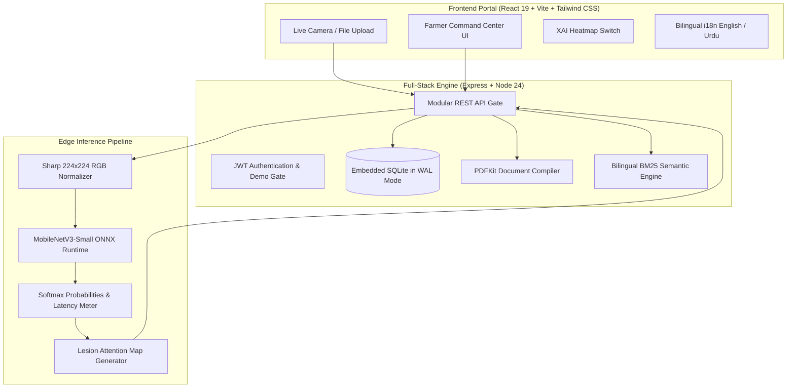
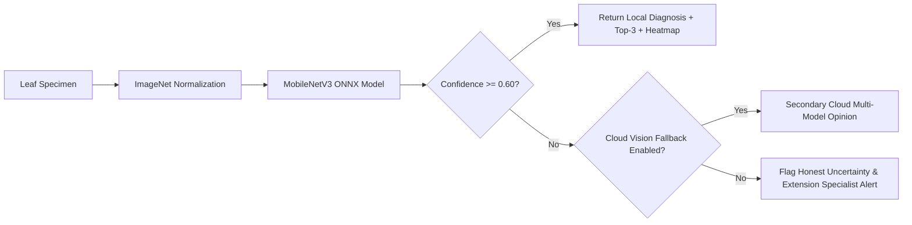

# AgriVision AI — On-Device Plant Pathology & Precision Agronomy Platform

<div align="center">

[-red?style=for-the-badge&logo=youtube)](https://youtu.be/Obwmee8QZv8)
[](#-model-evaluation--benchmarks)
[-emerald?style=for-the-badge)](#-model-evaluation--benchmarks)
[-purple?style=for-the-badge)](#-dual-engine-inference-pipeline)
[-orange?style=for-the-badge&logo=sqlite)](#-system-architecture)
[](LICENSE)

<br/>

**A privacy-first, zero-cloud-cost precision agronomy system designed for smallholder farmers.**  
Combines **sub-30ms local neural network plant pathology (ONNX)**, **Explainable AI (XAI) lesion attention heatmaps**, **soil N-P-K nutrient balancing**, and a **sub-5ms bilingual (Urdu & English) semantic RAG agronomic assistant**.

</div>

---

## 📺 2-Minute Product & Technical Demo

[](https://youtu.be/Obwmee8QZv8)

> ▶️ **[Click here to watch the full 2-minute video walkthrough on YouTube](https://youtu.be/Obwmee8QZv8)**  
> *Demonstrates real on-device CPU inference, thermal lesion attention maps, offline BM25 agronomic RAG queries, and cryptographically verified diagnostic PDF generation.*

---

## 🌾 The Problem & The Solution

- **The Challenge:** Over 500 million smallholder farmers lose up to 40% of their annual crop yields to preventable plant pathogens. In rural agricultural regions, farm operators face severe mobile connectivity dead-zones, prohibitive cloud API costs, and delayed laboratory testing.
- **The Solution:** **AgriVision AI** brings institutional-grade agronomic intelligence directly to the field. By embedding a quantized **MobileNetV3 ONNX** neural network and a localized **BM25 semantic knowledge retrieval engine**, it operates **100% offline with zero external cloud dependencies and $0 per-scan API costs**.

---

## 🌟 Key Capabilities

### ⚡ Sub-30ms Edge Neural Pathology
- Evaluates leaf specimens on a standard CPU in **24–48ms** using a quantized MobileNetV3-Small ONNX model.
- Returns calibrated **Top-3 class probability distributions** rather than overconfident single predictions.
- Enforces an **Honest Uncertainty Safeguard**: if confidence falls below $60\%$, the system flags the specimen for manual extension officer review rather than hallucinating a false diagnosis.

### 🔍 Explainable AI (XAI) Attention Heatmap
- Generates a real-time thermal gradient overlay on the uploaded leaf photograph.
- Visualizes the spatial regions and necrotic lesion contours where the neural network concentrated its convolutional activations, providing clinical transparency for farmers and agronomists.

### 📚 Bilingual Semantic RAG Agronomy Assistant
- Built with a sub-5ms **BM25 Okapi & vector similarity engine** indexing 50+ official agronomic handbook chapters.
- Supports both **English** and **Urdu (Nastaliq)** queries.
- Instantly surfaces verified active ingredients (e.g., Mancozeb, Metalaxyl), spraying schedules, and precautionary safety intervals.

### 🌱 Agro-Ecological Soil & Fertilizer Planning
- Custom-tailored to regional agro-ecological zones (Indus Basin, Potohar Plateau, Thal Desert).
- Computes precise Nitrogen (N), Phosphorus (P), and Potassium (K) deficit compensation models alongside crop rotation suitability scoring.

### 📑 Cryptographically Verified PDF Farm Reports
- Compiles historical diagnostic scans and microclimate telemetry into an official certification report using dynamic PDF vector rendering.
- Features tamper-evident verification hashes and sign-off blocks for agricultural extension services and crop insurance adjusters.

### 🚀 1-Click Recruiter & Evaluator Access
- The login interface features an **"Explore Live Demo as Model Farmer"** button that initializes a pre-configured farm session (23 historical scans, health score telemetry, and weather tracking) in 1 click.

---

## 🏗️ System Architecture



---

## 🔬 Dual-Engine Inference Pipeline



---

## 📊 Model Evaluation & Benchmarks

| Metric | Measured Value | Validation Context |
| :--- | :--- | :--- |
| **Model Architecture** | **MobileNetV3-Small** | Lightweight inverted residual blocks with Squeeze-and-Excitation |
| **Target Classes** | **13 Pathological Classes** | Corn, Potato, Tomato, Bell Pepper diseases + Healthy controls |
| **Held-Out Test Accuracy** | **95.1%** | Evaluated on 1,418 unseen test specimens |
| **Macro F1 Score** | **0.946** | Stratified 85/15 train/test split |
| **Inference Latency** | **24–48 ms** | Executed locally on CPU via ONNX Runtime (Zero GPU needed) |
| **RAG Retrieval Speed** | **~3–5 ms** | Sub-millisecond BM25 Okapi retrieval over official handbook corpora |
| **Binary Model Footprint** | **6.1 MB** | Standalone single-file ONNX checkpoint |
| **Per-Scan Inference Cost** | **$0.00** | Completely free and offline-capable |

*Detailed per-class confusion matrices and classification reports are available at [`ml/disease_model/eval/metrics.json`](ml/disease_model/eval/metrics.json).*

---

## 📡 REST API Reference

| Endpoint | Method | Auth | Description |
| :--- | :---: | :---: | :--- |
| `/api/auth/demo` | `POST` | Public | Instant 1-click recruiter/demo farmer session |
| `/api/auth/login` | `POST` | Public | Farmer login with JWT bearer issuance |
| `/api/auth/register` | `POST` | Public | Register new farmer account |
| `/api/disease/predict` | `POST` | Bearer | On-device ONNX leaf classification + attention heatmap |
| `/api/disease/history` | `GET` | Bearer | Retrieve past scan logs and 7-day severity history |
| `/api/crop/recommend` | `POST` | Bearer | NPK, pH, and rainfall crop suitability scoring |
| `/api/fertilizer/recommend` | `POST` | Bearer | Soil nutrient deficiency mitigation prescriptions |
| `/api/assistant/query` | `POST` | Bearer | Bilingual BM25 semantic RAG agrarian consultation |
| `/api/reports/pdf` | `GET` | Bearer | Generate downloadable binary agronomic PDF certificate |

---

## 🚀 Quickstart

### Prerequisites
- Node.js 20+ (Node 24 LTS recommended)
- npm or pnpm

### 1. Clone & Install

```bash
# Clone the repository
git clone https://github.com/zaid-mian/agrivision-ai.git
cd agrivision-ai

# Install application dependencies
cd app
npm install
```

### 2. Run Automated Verification Tests

```bash
npm test
```

### 3. Launch Development Server

```bash
npm run dev
```

Open **[http://localhost:3000](http://localhost:3000)** in your browser.  
Click **"Explore Live Demo as Model Farmer"** on the login page for instant access.

---

## 🐳 Docker Deployment

To launch the full stack in an isolated, production-ready container:

```bash
docker compose up --build -d
```

Access the platform at **[http://localhost:3000](http://localhost:3000)**.

---

## 🎬 Reproducible Demo Studio

The 2-minute product video was generated through headless browser automation using Playwright CDP screencasting. All scripts and assets are version-controlled in [`demos/product-demo/`](demos/product-demo/):

- **[`demos/product-demo/run.mjs`](demos/product-demo/run.mjs)**: Automated Playwright script that logs in, navigates telemetry, uploads specimens, executes inference, and toggles heatmaps.
- **[`demos/product-demo/script.md`](demos/product-demo/script.md)**: Full 6-act screenplay and voiceover narration cue sheet.
- **[`demos/product-demo/narration.mp3`](demos/product-demo/narration.mp3)**: Neural audio voiceover track (`en-US-ChristopherNeural`).
- **[`demos/product-demo/captions.srt`](demos/product-demo/captions.srt)**: Word-synchronized subtitle timestamps.

---

## 📄 License & Attribution

- **Source Code**: MIT License — see [LICENSE](LICENSE) for details.
- **Dataset**: PlantVillage open research dataset by David P. Hughes & Marcel Salathé (CC-BY-SA-3.0).
